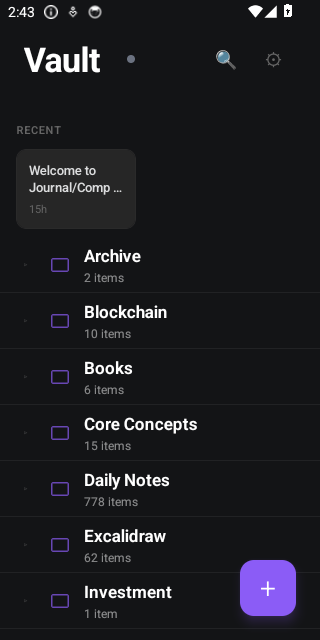
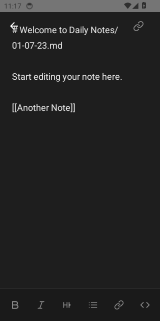
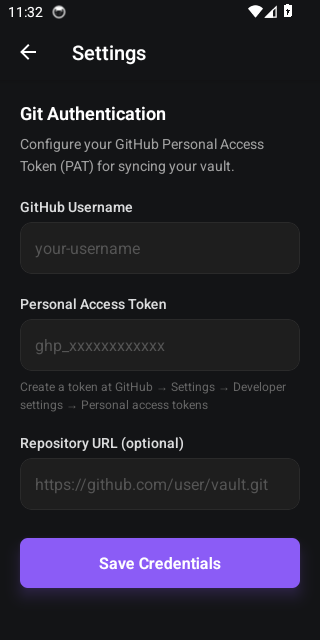

# Obsidian Git Mobile

A React Native app for syncing Obsidian vaults via Git.

<p align="center">
  
  
  
</p>

## Features

- 📝 Markdown editing with syntax dimming & toolbar
- 📁 File tree with rename, move, delete, folder creation
- 🔗 Wikilinks with `[[autocomplete]]` and backlinks
- 🔍 Full-text search (SQLite FTS5)
- 🔄 Git sync with auto-sync intervals
- 📱 Haptic feedback & spring animations
- ♿ WCAG AA accessible

## Install

Download APK from [Releases](https://github.com/yongkangc/obsidian-git-mobile/releases).

## Setup Guide

### 1. Create a GitHub Repository

Create a new repository for your vault (or use an existing one with markdown files):
- Go to [github.com/new](https://github.com/new)
- Name it (e.g., `obsidian-vault`)
- Set to **Private** for personal notes
- Initialize with README if empty

### 2. Generate a Personal Access Token

1. Go to [GitHub Settings → Developer settings → Personal access tokens → Fine-grained tokens](https://github.com/settings/tokens?type=beta)
2. Click **Generate new token**
3. Set expiration and select your vault repository
4. Under **Repository permissions**, grant **Contents: Read and write**
5. Generate and copy the token

### 3. Configure the App

1. Open the app and tap **Settings** (gear icon)
2. Enter your **GitHub Username**
3. Paste your **Personal Access Token**
4. Enter the **Repository URL**: `https://github.com/username/obsidian-vault.git`
5. Tap **Clone Repository**

### 4. Sync Your Vault

- **Manual sync**: Pull down on the vault screen or tap the sync button
- **Auto-sync**: Enable in Settings with 1/5/15/30 minute intervals
- Changes sync automatically when auto-sync is enabled

## Build

```bash
npm install
npx react-native bundle --platform android --dev false \
  --entry-file index.js \
  --bundle-output android/app/src/main/assets/index.android.bundle \
  --assets-dest android/app/src/main/res
cd android && ./gradlew assembleDebug
```

## Development

```bash
npm start          # Metro bundler
npm run android    # Run app
npm run typecheck  # TypeScript
npm run test       # 235 tests
```

## License

MIT
