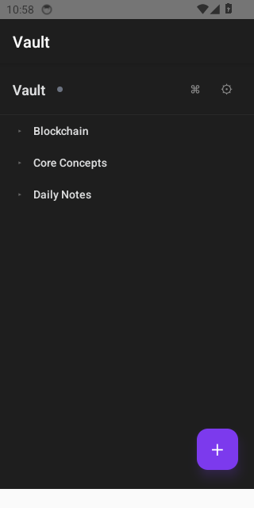
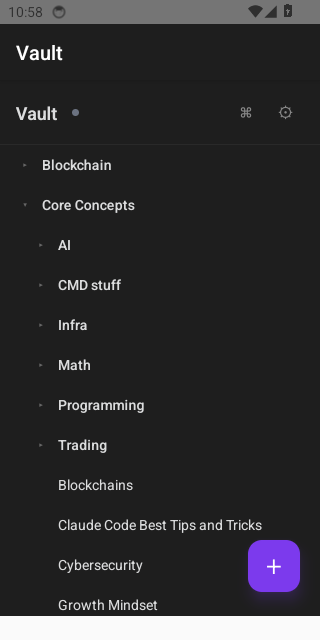
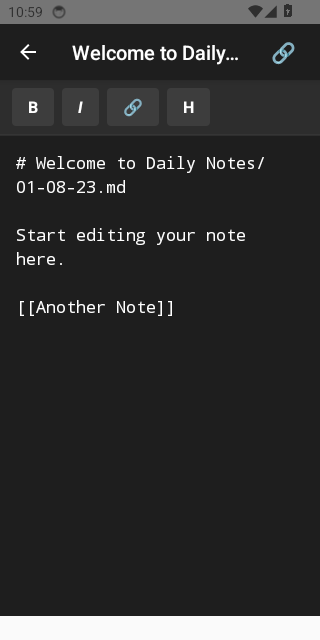

# Obsidian Git Mobile

A React Native mobile app for syncing Obsidian vaults via Git. Inspired by Obsidian's clean, minimal design.

<p align="center">
  
  
  
</p>

## Features

- 📝 **Markdown editing** with live preview toolbar (bold, italic, links, headers)
- 📁 **File tree browser** with collapsible folders
- 🔗 **Wikilink support** with `[[autocomplete]]`
- 🔙 **Backlinks panel** showing notes linking to current note
- 🔍 **Full-text search** with fuzzy matching
- 🔄 **Git sync** (clone, pull, push) with offline queue
- ⌘ **Quick switcher** for fast file navigation
- ⚙️ **Settings** for GitHub authentication (OAuth/PAT)

## Performance

| Metric | Target | Actual |
|--------|--------|--------|
| Cold start | < 2s | **685ms** ✅ |
| File open | < 100ms | ✅ |
| Quick switcher | < 50ms | ✅ |
| Frame time (p50) | < 16ms | 16ms ✅ |

## Getting Started

> Make sure you have completed the [React Native environment setup](https://reactnative.dev/docs/set-up-your-environment).

### Install dependencies

```bash
npm install
```

### iOS setup

```bash
bundle install
bundle exec pod install
```

### Run the app

```bash
# Start Metro
npm start

# In another terminal
npm run android  # or
npm run ios
```

## Development

```bash
npm run lint        # ESLint
npm run typecheck   # TypeScript
npm run test        # Jest tests
```

## E2E Tests

```bash
npm run detox:build:android
npm run detox:test:android
```
